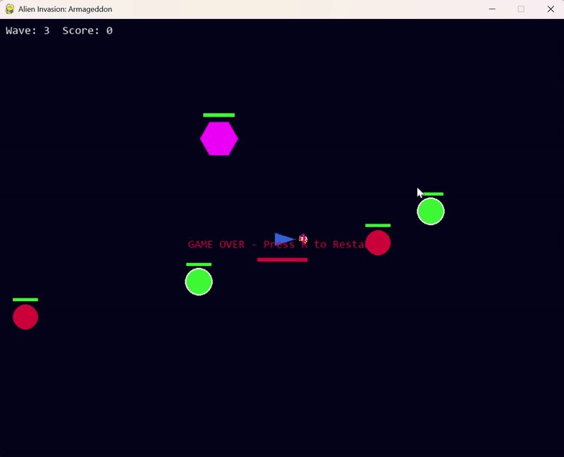

# 👾 Alien Invasion: Armageddon

## 👤 Author

| Name            | Role              | LinkedIn                                      |
|-----------------|-------------------|-----------------------------------------------|
| Jason Emmanuel  | Game Developer    | [linkedin.com/in/jasoneml](https://www.linkedin.com/in/jasoneml/) |

 

**Alien Invasion: Armageddon** is a high-difficulty, object-oriented 2D space shooter designed for advanced Python developers, game enthusiasts, and AI simulation hobbyists. Built with Pygame, it demonstrates how complex gameplay mechanics, enemy intelligence, and modular code architecture can come together to form a polished and replayable arcade experience.

Unlike beginner-level shooter games, this project features distinct alien behaviors, including healing support units, tank-like enemies with polygonal bodies, and swarm attackers. It incorporates dynamic wave progression, power-up mechanics, and particle-based explosion effects that create a visually engaging and mechanically challenging environment.

The game’s structure is built around clear object-oriented principles, making it easy to expand or customize. With logging tools, a dynamic difficulty curve, and a focus on responsiveness and feedback, *Armageddon* provides both an exciting gameplay experience and a strong foundation for learning advanced game development in Python.

---

## 🎮 Gameplay Features

### 🚀 Core Mechanics
- **Top-Down Real-Time Combat**  
  Engage in fast-paced battles with dynamic movement and responsive controls.

- **Physics-Based Movement**  
  Ships and enemies follow inertia-based motion with friction and drag for a smooth arcade feel.

---

### 👾 Alien Types & Behaviors

- **🟥 Sinib (Attacker Alien)**  
  - Shape: Red Circle  
  - Behavior: Standard enemy type that aggressively chases the player.

- **🟩 Fardumun (Healer Alien)**  
  - Shape: Green Circle  
  - Behavior: Emits green healing pulses to regenerate nearby enemy health.  
  - Visuals: Displays unique green "➕" signs when healing is triggered.

- **🟪 Vorgulax (Tank Alien)**  
  - Shape: Magenta Polygon  
  - Behavior: Brute alien with reinforced health; absorbs heavy damage.

---

### 🔫 Weapon & Power-Up Systems

- **Weapon Mechanics**  
  - Adjustable bullet cooldown and customizable fire rate.

- **Power-Ups**
  - 💚 **Health Recovery** – Instantly restores player's health.  
  - ⚡ **Rapid Fire** – Temporarily increases fire rate.  
  - 🔫 **Multi-Shot Spread** – Temporarily enables triple-shot pattern.

---

### 💥 Visual & Audio Effects

- **Explosions**  
  - Particle-based effects simulate alien deaths and collisions in real-time.

- **Healing Visuals**  
  - Green "➕" particles appear when Fardumun heals other enemies.

---

### 🎯 Difficulty Scaling

- **Wave-Based Progression**  
  - Each wave introduces more enemies with increased strength.  
  - Wave data is automatically logged for debugging and tracking.

---

### 📊 UI & Status Display

- Score Counter  
- Current Wave Indicator  
- Dynamic Health Bar

---

### 🧾 Logging System

- Logs game progress and wave data to a `/logs/` directory.  
- Includes timestamps and detailed debug info per wave.


---

## 📜 Backstory

In the year 2471, nestled deep within the Helion Research Colony, Earth’s most brilliant quantum physicists embarked on a last-ditch mission to save a dying world. Decades of climate collapse, endless warfare, and the depletion of planetary resources had pushed civilization to the brink. Their goal was audacious, tap into the fabric of spacetime to draw clean, interdimensional energy from parallel universes. For a brief moment, hope flickered. The equations worked. The prototype activated. But instead of salvation, the project tore open a shimmering rift to an unknown dimension later designated as the Nezrion Expanse.

From this breach came not energy, but a silent invasion. The first signs were subtle: malfunctioning satellites, lost deep-space drones, and ghost signals from beyond the stars. What followed was swift and catastrophic. Sleek, biomechanical beings poured through the rift, fused organisms enhanced with cold, synthetic augmentation. They were not explorers or diplomats. They were conquerors. They were the Nezrion Horde.

Within mere hours of full breach activation, Earth's orbital defenses were annihilated. The coordinated attack crippled communication arrays, disrupted artificial intelligence networks, and unleashed electromagnetic storms that rendered planetary defense grids useless. Major cities were flattened. The Moon colonies went dark. Mars outposts, once humanity’s beacon of expansion, fell completely silent. Fleet Command Omega, Earth's final military bastion, issued a distress signal that looped into the void, unanswered.

Amidst the devastation, one ship survived, buried deep in a hangar beneath the Helion base. The Aegis-X, a prototype starfighter equipped with experimental weapons and high-precision maneuvering thrusters, had been offline for maintenance when the first EMP wave struck. By sheer chance or fate, it escaped destruction. Now, reawakened in silence and surrounded by ruin, it stands as Earth’s last hope.

You are its pilot. There is no chain of command. No allies. No fallback. Just you, your instincts, and the Aegis-X against an alien force that is not only intelligent, but adaptive. The Nezrion are evolving with each wave.

---

## 🕹️ Controls

| Key          | Action                  |
|--------------|--------------------------|
| `← / →`      | Rotate ship              |
| `↑`          | Apply thrust             |
| `SPACE`      | Fire weapon              |
| `R`          | Restart after defeat     |

---

## 🔧 Tools & Libraries Used

| Tool / Library | Purpose                                                                 |
|----------------|-------------------------------------------------------------------------|
| **Python**     | Core programming language                                               |
| **Pygame**     | 2D game engine used for rendering, input, sound, and main game loop     |
| **logging**    | Wave tracking and debugging logs saved in `/logs/`                      |
| **math**       | Trigonometry functions for angles, directions, and vector math          |
| **random**     | Randomized enemy behavior, spawn locations, power-up selection          |
| **datetime**   | Timestamped log filenames                                               |
| **os**         | Directory creation for logs                                             |
| **sys**        | Graceful system exit after quitting the game                            |

---

## 🧰 Installation & Setup

### Prerequisites

- Python 3.7 or newer
- [Pygame](https://www.pygame.org/) library

### Clone and Run

```bash
git clone https://github.com/namoklom/alien-armageddon.git
cd alien-invasion-armageddon
pip install pygame
python main_games.py
```
